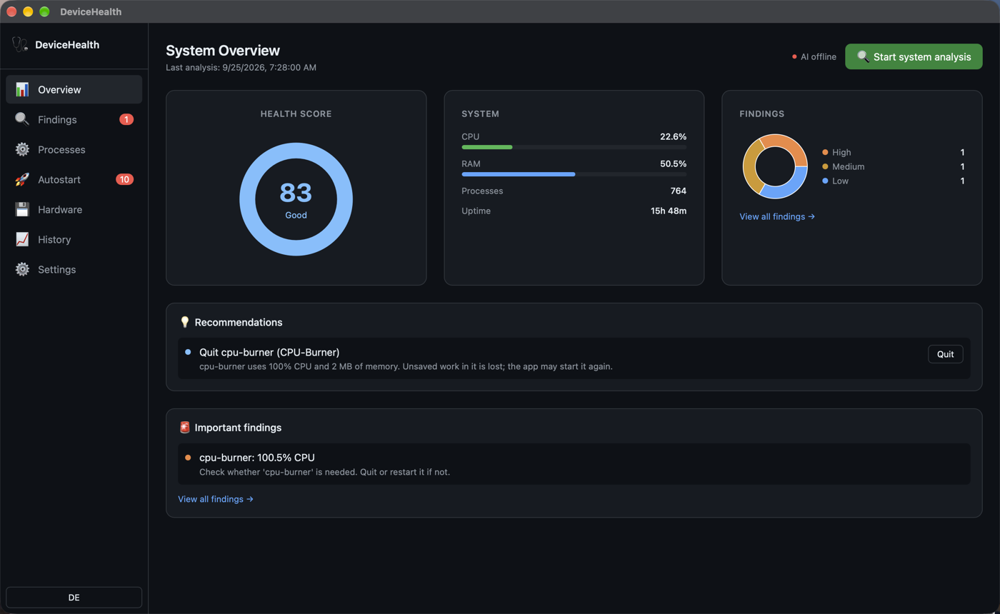

<div align="center">
  

  <h1>DeviceHealth</h1>
</div>

[🇩🇪 Deutsche Version](README.de.md)

**AI-powered system diagnostics and health monitoring. Offline by design, your system data stays on the device. Built with Rust and Tauri.**

DeviceHealth analyzes all running processes, services, hardware components, and network activity on your machine, detects problems automatically, and provides plain-language AI explanations with concrete optimization recommendations; 100% locally, without any cloud connection.

[](https://github.com/9t29zhmwdh-coder/DeviceHealth/actions)      

> **How it runs:** DeviceHealth is a native desktop app, not a server or browser tool. It opens as its own window and has no tray icon or background service; it only scans your system while you actively trigger a run.



**In practice:** you trigger a scan, get a 0 to 100 health score with categorized findings (bloatware, zombie processes, autostart clutter, security risks), and can ask Ollama to explain any process in plain language before deciding what to fix. Every snapshot is stored locally so you can track the trend over time.

---

> 🌱 New here? → [Step-by-step guide for beginners](GETTING_STARTED.md)

---

## Features

| Feature | Description |
|---|---|
| **Health Score** | Numerical 0 to 100 rating with grade (Excellent → Critical) |
| **Process Analysis** | Detects bloatware, telemetry, zombie processes, CPU spikes, RAM leaks |
| **Findings** | Categorized issues (Critical / High / Medium / Low / Info) with fix recommendations |
| **Hardware Monitor** | CPU, RAM, disk usage, temperatures, network I/O |
| **Autostart Detection** | Scans LaunchAgents (macOS) and systemd units (Linux) for unnecessary entries |
| **Security Findings** | Suspicious processes, open risks, driver errors, missing updates |
| **AI Explanations** | Ollama explains every process in plain language: results cached locally |
| **History** | Score trend and system snapshots over time with charts |
| **Smart Recommendations** | Actionable suggestions with risk level: one-click with confirmation |

---

## Requirements

- [Rust](https://rustup.rs/) 1.77+
- [Node.js](https://nodejs.org/) 20+
- [Tauri CLI v2](https://tauri.app/): `cargo install tauri-cli`
- [Ollama](https://ollama.ai) (optional, for AI explanations)
- macOS / Windows / Linux

> 🌱 New here? → [Step-by-step guide for beginners](GETTING_STARTED.md)

---

## Quick Start

```bash
git clone https://github.com/9t29zhmwdh-coder/DeviceHealth
cd DeviceHealth

# Optional: pull AI model for process explanations
ollama pull llama3

cd frontend && npm install && cd ..
cargo tauri dev
```

---

## Uninstall / Cleanup

- **macOS:** delete the app bundle, then remove `~/Library/Application Support/com.raystudio.devicehealth/` (snapshot history and AI cache)
- **Linux:** delete the app binary, then remove `~/.local/share/devicehealth/`
- **Windows:** uninstall via Settings → Apps, then remove `%LOCALAPPDATA%\RayStudio\DeviceHealth\`

No registry entries or background services are left behind.

---

## Privacy

DeviceHealth processes all system data **locally on your machine**. No data is sent to any external server. Ollama runs entirely offline; AI explanations never leave your device.

---

## Architecture

```
DeviceHealth/
├── crates/dh-core/      # Rust: analyzer, hardware, process detection, DB
├── crates/dh-cli/       # CLI binary
├── src-tauri/           # Tauri v2 backend + IPC commands
└── frontend/            # React + TypeScript + Tailwind + Recharts
```

### Analysis Pipeline

```
sysinfo ──► spawn_blocking ──► ProcessAnalyzer + HardwareAnalyzer
                                       │
                               SecurityAnalyzer + ServiceAnalyzer
                                       │
                               HealthScore (0 to 100) + Findings
                                       │
                               SQLite (snapshots, AI cache)
```

---

**Author:** [Rafael Yilmaz](https://github.com/9t29zhmwdh-coder) · **Status:** Active ·  · **License:** MIT
